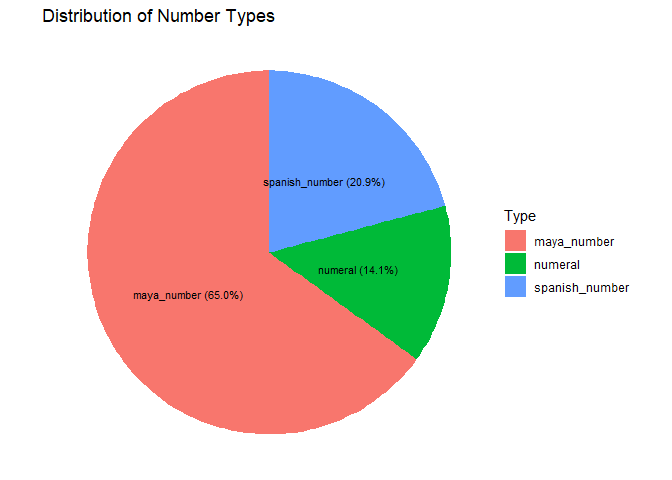
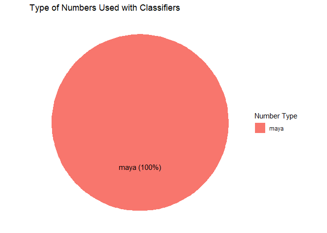
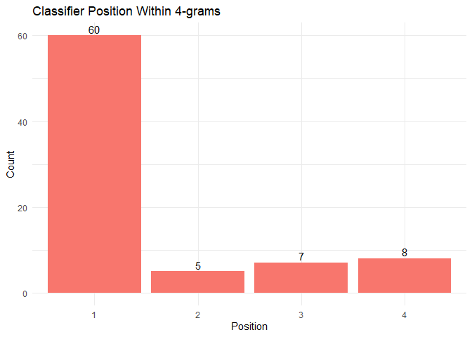
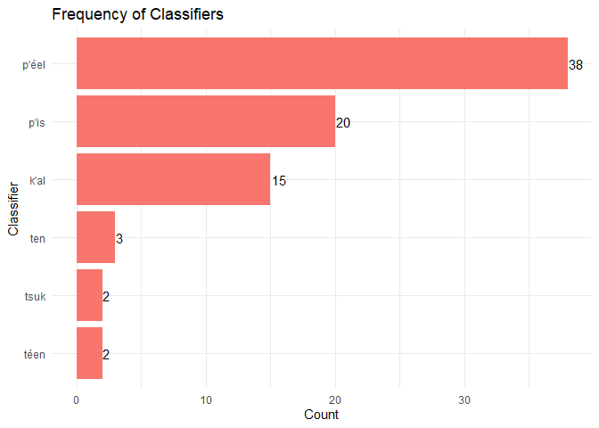

# Numbers in Colonial Maya Texts
Alex LaPrevotte
2026-04-30

**I have opted to add my new code, as I go, to my existing quarto
document.**

My goal for processing these data is to get the text into a format I can
work with. The data, available as part of “Los títulos de ebtún :
transcripción, traducción y análisis histórico,” the PhD dissertation of
Dr. Julien Machault, which can be found
[here](https://tesiunamdocumentos.dgb.unam.mx/ptd2025/abr_jun/0869324/Index.html),
are currently in a PDF, broken into chunks of five lines:

- a transcription of the original colonial Maya text (in original
  orthography)
- a transcription of the text with modern orthography
- a morphological breakdown
- a morphological gloss
- a Spanish translation.

I am working with a 200-page excerpt from this PDF (pages 301-500) and I
am attempting, as much as possible, to account for situations that do
not arise in the current data within the code, so it could be applied to
a larger data set. I anticipate my working data, pre-analysis, will take
the form of a data frame with two columns (morphological breakdown,
morphological gloss) and many rows, one per word. I plan to eliminate
the original orthography, modern orthography, and Spanish translation
because they contain special characters, do not correspond well with the
other lines in number of words, and the only way to correlate the
Spanish translations with the Maya would be manually, due to differences
in word order and agglutination.

## Reading in the data

``` r
# read in the text with each page as a row
ebtun_text <-pdf_text("data/ebtun_sample.pdf")

# lines to rows
ebtun_text <- strsplit(ebtun_text, "\n")

# combine all pages into one vector
ebtun_text <- unlist(ebtun_text)

# currently 1 column, 7695 rows
```

## Combining morphological breakdowns into single units

``` r
# eliminating multiple spaces and spaces before and after hyphens
# this should keep morphological breakdowns and glosses together
ebtun_text <- ebtun_text |>
  str_replace_all("[ \\t]+-", "-") |> 
  str_replace_all("-[ \\t]+", "-") |> 
  str_squish()                        

# eliminating null characters
ebtun_text <- str_replace_all(ebtun_text, "\\bø\\b", "")

# convert to dataframe
ebtun_data <- data.frame(line = ebtun_text)

# still 1 column, 7695 rows
```

## Cleaning up the rows

``` r
# convert everything to lower case
ebtun_data <- ebtun_data %>% mutate(across(where(is.character), tolower))

# eliminating incomplete chunks, parts entirely in Spanish, document titles, and footers
# eliminating chunks where one or more lines goes onto a second row, disrupting the 5-line chunk format
ebtun_data <- ebtun_data[-c(1, 252, 598:618, 671:676, 679:684, 885:890, 1080:1085, 1117:1122, 1133:1136, 1141:1185, 1307:1312, 1401:2043, 2079, 2558:2591, 2616, 2882:2891, 2919, 3226, 3587:3592, 3760, 3906:3981, 4748, 4826, 5384:5419, 5440, 6050, 6454:6493, 6891, 7261, 7274:7282, 7295:7315, 7401, 7689:7692), ]

# again, we make it a data frame
ebtun_data <- data.frame(line = ebtun_data)

# eliminate rows that only include numbers, and spaces as well as rows that start with "doc.", "verso", or "sigue en"
ebtun_data <- ebtun_data %>%
  filter(
    !str_detect(.data$line, "^\\s*$"),
    !str_detect(.data$line, "^\\s*\\d{0,3}\\s*$"),
    !str_detect(.data$line, "^\\s*(verso|doc\\.|sigue en)")
  )

# make it a dataframe yet again
ebtun_data <- data.frame(line = ebtun_data, stringsAsFactors = FALSE)

# currently 1 column, 3965 rows
```

## Breaking the data into chunks

``` r
# my goal here is to break the data back down into the 5-line chunks that were the basis of the PDF formatting

# every 5 lines to a group
ebtun_grouped <- ebtun_data |>
  mutate(group = ceiling(row_number() / 5),
         type = rep(c("original", "Maya", "morphemes", "glossed", "Spanish"),
                    length.out=n()))

# currently 793 data frames, each two columns (line and group number) and five rows
```

## Removing rows not used in analysis

``` r
# eliminating rows 1 (original text), 2 (modern orthography), and 5 (Spanish translation) from each chunk
#ebtun_chunks <- lapply(ebtun_chunks, function(df) {
#  df[3:4, , drop = FALSE]
#})

ebtun_grouped <- ebtun_grouped |>
  filter(type %in% c("morphemes", "glossed"))

# each group to a dataframe
ebtun_chunks <- split(ebtun_grouped, ebtun_grouped$group)
```

## Split chunks by word

``` r
# function: split chunk into words
  # split each line by spaces
  # find max words in the chunk and add NAs to standardize columns
  # combine into data frame
split_chunk <- function(df_chunk) {
  split_words <- str_split(df_chunk$line, "\\s+", simplify = FALSE)
  max_words <- max(lengths(split_words))
  split_words_padded <- lapply(split_words, function(x) {
    length(x) <- max_words
    x
  })
  df_words <- as.data.frame(do.call(rbind, split_words_padded), stringsAsFactors = FALSE)
  return(df_words)
}

# use function on chunks
ebtun_chunks <- lapply(ebtun_chunks, split_chunk)

#currently 2 rows, 4491 columns (793 chunks)
```

## NA wrangling

``` r
# which chunks have NAs? (visual check)
na_counts <- sapply(ebtun_chunks, function(df) sum(is.na(df)))
#na_counts

# eliminate chunks with NAs
ebtun_chunks_nona <- ebtun_chunks[!sapply(ebtun_chunks, function(df) any(is.na(df)))]

# check to make sure number of chunks has decreased
length(ebtun_chunks_nona)
```

    [1] 771

``` r
# down to 771 chunks
```

## Chunk concatenation

``` r
# number of rows
num_rows <- nrow(ebtun_chunks_nona[[1]])

# concatenate rows by chunk (this takes a while)
ebtun_combined <- map_dfr(1:num_rows, function(i) {
  rows <- lapply(ebtun_chunks_nona, function(df) df[i, , drop = FALSE])
  suppressMessages(
    bind_cols(rows, .name_repair = "minimal")
  )
})

#drop the column names
colnames(ebtun_combined) <- NULL
```

## Data transposition

``` r
# turn those rows into columns
ebtun_long <- t(ebtun_combined)

# convert back to data frame
ebtun <- as.data.frame(ebtun_long)

# currently 2 columns (morphological breakdown and morphological gloss), 4311 rows
```

## Final data cleaning

``` r
# removing leading and trailing spaces
ebtun$V1 <- str_trim(ebtun$V1)
ebtun$V2 <- str_trim(ebtun$V2)

# remove rows containing cells that are just ellipses (either the ellipses character or three consecutive periods)
ebtun <- ebtun |>
  filter(if_all(everything(), ~ !str_trim(.) %in% c("...", "…")))

#naming the columns because I'm about to add more and it seems responsible
ebtun <- ebtun |>
  rename(
    breakdown = V1,
    gloss = V2
  )

# final form of "found" data
str(ebtun)
```

    'data.frame':   3989 obs. of  2 variables:
     $ breakdown: chr  "tumen" "u-comisyon" "ajaw" "aj-tepal" ...
     $ gloss    : chr  "cause" "3a-comición" "gobernante" "ag-gobierno" ...

``` r
# currently 2 columns (morphological breakdown and morphological gloss), 3989 rows
```

## Analysis

### Finding numbers

``` r
# reading in lists of Spanish and Maya numbers (textual)
esp_numbers <- read_lines("data/esp_numbers.txt")
maya_numbers <- read_lines("data/maya_numbers.txt")

# normalizing sources
esp_numbers <- stringi::stri_trans_nfc(esp_numbers)
maya_numbers <- stringi::stri_trans_nfc(maya_numbers)
ebtun$breakdown <- stringi::stri_trans_nfc(ebtun$breakdown)
ebtun$gloss <- stringi::stri_trans_nfc(ebtun$gloss)

# define numbers for gloss column (numerals or spanish numbers as morph segments)
number_pattern <- paste0(
  "(^|-)",
  "(",
  "\\d+",
  "|",
  paste(esp_numbers, collapse = "|"),
  ")",
  "($|-)"
)

# find solo numbers in gloss column
ebtun <- ebtun |>
  mutate(
    gloss_number = str_detect(gloss, number_pattern)
  )

# find numerals in breakdown column
ebtun <- ebtun |>
  mutate(
    numeral = str_detect(str_trim(breakdown), "(^|-)[0-9]+($|-)"))

# find Maya and Spanish numbers in breakdown column
ebtun <- ebtun |>
  mutate(
    maya_number =
      str_detect(breakdown, paste(maya_numbers, collapse = "|")) &
      gloss_number,
    spanish_number =
      str_detect(breakdown, paste(esp_numbers, collapse = "|")) &
      gloss_number
  )

str(ebtun)
```

    'data.frame':   3989 obs. of  6 variables:
     $ breakdown     : chr  "tumen" "u-comisyon" "ajaw" "aj-tepal" ...
     $ gloss         : chr  "cause" "3a-comición" "gobernante" "ag-gobierno" ...
     $ gloss_number  : logi  FALSE FALSE FALSE FALSE FALSE FALSE ...
     $ numeral       : logi  FALSE FALSE FALSE FALSE FALSE FALSE ...
     $ maya_number   : logi  FALSE FALSE FALSE FALSE FALSE FALSE ...
     $ spanish_number: logi  FALSE FALSE FALSE FALSE FALSE FALSE ...

``` r
#currently 6 columns, 3988 rows

# counting how many numerals, Maya numbers, and Spanish numbers are in the data
number_counts <- data.frame(
  type = c("numeral", "maya_number", "spanish_number"),
  count = c(
    sum(ebtun$numeral, na.rm = TRUE),
    sum(ebtun$maya_number, na.rm = TRUE),
    sum(ebtun$spanish_number, na.rm = TRUE)
  )
)

number_counts
```

                type count
    1        numeral    23
    2    maya_number   106
    3 spanish_number    34

### Creating 4-grams

``` r
breakdown_tokens <- str_split(ebtun$breakdown, "\\s+") |> unlist()
gloss_tokens     <- str_split(ebtun$gloss, "\\s+") |> unlist()

row_index <- rep(seq_len(nrow(ebtun)), times = lengths(str_split(ebtun$breakdown, "\\s+")))

valid_rows <- which(
  ebtun$numeral |
  ebtun$maya_number |
  ebtun$spanish_number
)

num_positions <- which(row_index %in% valid_rows)

number_4grams <- purrr::map_dfr(num_positions, function(pos) {
  
  b_gram <- breakdown_tokens[pos:min(pos + 3, length(breakdown_tokens))]
  g_gram <- gloss_tokens[pos:min(pos + 3, length(gloss_tokens))]
  tibble(
    index = pos,
    row = row_index[pos],
    number = breakdown_tokens[pos],
    b1 = b_gram[1], b2 = b_gram[2], b3 = b_gram[3], b4 = b_gram[4],
    g1 = g_gram[1], g2 = g_gram[2], g3 = g_gram[3], g4 = g_gram[4]
  )
})

number_4grams <- number_4grams |>
  mutate(
    number_type = case_when(
      ebtun$numeral[row] ~ "numeral",
      ebtun$maya_number[row] ~ "maya",
      ebtun$spanish_number[row] ~ "spanish",
      TRUE ~ "unknown"
    )
  )
```

``` r
# read in a list of known classifiers
classifiers <- read_lines("data/classifiers.txt")
classifiers <- stringi::stri_trans_nfc(classifiers)

# there are classifiers in this text I'm not familiar with, but at least some of them were glossed as "cn" so I am finding those and adding them to the above-created vector

# many classifiers are glossed with "cn"
cn_pattern <- "(^cn$)|(^cn-)|(-cn$)|(-cn-)"

# looking for "cn" morphemes in gloss
number_4grams <- number_4grams |>
  mutate(
    g1_cn = str_detect(g1, cn_pattern),
    g2_cn = str_detect(g2, cn_pattern),
    g3_cn = str_detect(g3, cn_pattern),
    g4_cn = str_detect(g4, cn_pattern)
  )

# filter for matches
cn_4grams <- number_4grams |>
  filter(g1_cn | g2_cn | g3_cn | g4_cn)

# extract pairs
cn_pairs <- bind_rows(
  cn_4grams |> transmute(number_type, position = 1, b = b1, g = g1, cn = g1_cn),
  cn_4grams |> transmute(number_type, position = 2, b = b2, g = g2, cn = g2_cn),
  cn_4grams |> transmute(number_type, position = 3, b = b3, g = g3, cn = g3_cn),
  cn_4grams |> transmute(number_type, position = 4, b = b4, g = g4, cn = g4_cn)
) |>
  filter(cn == TRUE)

# I used this to visually review things glossed as numeral classifiers, but with which I was not familiar
# view(cn_pairs)

# adding the other classifiers to the existing vector
classifiers <- c(classifiers, "p'is", "tsuk", "k'al")

# collapse to one regex
classifier_pattern <- paste0(
  "(^|-)",
  "(",
  paste(classifiers, collapse = "|"),
  ")",
  "($|-)"
)

# looking for classifier locations in 4_grams
number_4grams <- number_4grams |>
  mutate(
    c1 = str_detect(str_trim(b1), classifier_pattern),
    c2 = str_detect(str_trim(b2), classifier_pattern),
    c3 = str_detect(str_trim(b3), classifier_pattern),
    c4 = str_detect(str_trim(b4), classifier_pattern)
  )

# count by number type and position
classifier_counts <- number_4grams |>
  group_by(number_type) |>
  summarise(
    token1 = sum(c1, na.rm = TRUE),
    token2 = sum(c2, na.rm = TRUE),
    token3 = sum(c3, na.rm = TRUE),
    token4 = sum(c4, na.rm = TRUE)
  )

view (classifier_counts)
```

``` r
# does 4-gram contain a classifier
number_4grams <- number_4grams |>
  mutate(
    classifier_any = c1 | c2 | c3 | c4
  )

# filtering for true
classifier_4grams <- number_4grams |>
  filter(classifier_any)

view(classifier_4grams)
```

## Data Visualization

``` r
# pie chart proportion of each kind of number
ggplot(
  number_counts |>
    mutate(prop = count / sum(count),
           label = paste0(type, " (", scales::percent(prop), ")")),
  aes(x = "", y = count, fill = type)
) +
  geom_col(width = 1) +
  coord_polar(theta = "y") +
  geom_text(
    aes(label = label),
    position = position_stack(vjust = 0.5),
    size = 3
  ) +
  labs(
    title = "Distribution of Number Types",
    fill = "Type"
  ) +
  theme_void()
```



``` r
# count classifier occurrence by number type
classifier_language_counts <- number_4grams |>
  filter(classifier_any) |>
  count(number_type)

classifier_language_counts <- classifier_language_counts |>
  mutate(prop = n / sum(n),
         label = paste0(number_type, " (", scales::percent(prop), ")"))

# pie chart for classifier count by number type
ggplot(classifier_language_counts, aes(x = "", y = n, fill = number_type)) +
  geom_col(width = 1) +
  coord_polar(theta = "y") +
  geom_text(aes(label = label),
            position = position_stack(vjust = 0.5)) +
  labs(
    title = "Type of Numbers Used with Classifiers",
    fill = "Number Type"
  ) +
  theme_void()
```



``` r
# pivoting classifier location counts
classifier_position_counts <- classifier_counts |>
  pivot_longer(
    cols = starts_with("token"),
    names_to = "position",
    values_to = "count"
  )

# cleaning up my x-axis
classifier_position_counts <- classifier_position_counts |>
  mutate(position = str_remove(position, "token"))

# collapsing number type because they're all Maya
classifier_position_counts_simple <- classifier_position_counts |>
  group_by(position) |>
  summarise(count = sum(count), .groups = "drop")

# bar graph
# and I added the orange from the pie chart for visual consistency
ggplot(classifier_position_counts_simple,
       aes(x = position, y = count)) +
  geom_col(fill = "#F8766D") +
  geom_text(aes(label = count),
            vjust = -0.3) +
  labs(
    title = "Classifier Position Within 4-grams",
    x = "Position",
    y = "Count"
  ) +
  theme_minimal()
```



``` r
# extracting and counting classifiers
classifier_freq <- number_4grams |>
  select(b1, b2, b3, b4) |>
  pivot_longer(everything(), values_to = "token") |>
  filter(str_detect(token, classifier_pattern)) |>
  mutate(classifier = str_match(token, classifier_pattern)[,3]) |>
  count(classifier, sort = TRUE)

# bar graph
ggplot(classifier_freq,
       aes(x = reorder(classifier, n), y = n)) +
  geom_col(fill = "#F8766D") +
  geom_text(aes(label = n),
            hjust = -0.1) +
  coord_flip() +
  labs(
    title = "Frequency of Classifiers",
    x = "Classifier",
    y = "Count"
  ) +
  theme_minimal()
```



``` r
sessionInfo()
```

    R version 4.5.1 (2025-06-13 ucrt)
    Platform: x86_64-w64-mingw32/x64
    Running under: Windows 11 x64 (build 26200)

    Matrix products: default
      LAPACK version 3.12.1

    locale:
    [1] LC_COLLATE=English_United States.utf8 
    [2] LC_CTYPE=English_United States.utf8   
    [3] LC_MONETARY=English_United States.utf8
    [4] LC_NUMERIC=C                          
    [5] LC_TIME=English_United States.utf8    

    time zone: America/New_York
    tzcode source: internal

    attached base packages:
    [1] stats     graphics  grDevices utils     datasets  methods   base     

    other attached packages:
     [1] pdftools_3.6.0  lubridate_1.9.4 forcats_1.0.0   stringr_1.5.1  
     [5] dplyr_1.1.4     purrr_1.1.0     readr_2.1.5     tidyr_1.3.1    
     [9] tibble_3.3.0    ggplot2_3.5.2   tidyverse_2.0.0

    loaded via a namespace (and not attached):
     [1] bit_4.6.0          gtable_0.3.6       jsonlite_2.0.0     crayon_1.5.3      
     [5] qpdf_1.4.1         compiler_4.5.1     Rcpp_1.1.0         tidyselect_1.2.1  
     [9] parallel_4.5.1     scales_1.4.0       yaml_2.3.10        fastmap_1.2.0     
    [13] R6_2.6.1           labeling_0.4.3     generics_0.1.4     knitr_1.50        
    [17] pillar_1.11.0      RColorBrewer_1.1-3 tzdb_0.5.0         rlang_1.1.6       
    [21] stringi_1.8.7      xfun_0.52          bit64_4.6.0-1      timechange_0.3.0  
    [25] cli_3.6.5          withr_3.0.2        magrittr_2.0.3     digest_0.6.37     
    [29] grid_4.5.1         vroom_1.6.5        rstudioapi_0.17.1  askpass_1.2.1     
    [33] hms_1.1.3          lifecycle_1.0.4    vctrs_0.6.5        evaluate_1.0.4    
    [37] glue_1.8.0         farver_2.1.2       rmarkdown_2.29     tools_4.5.1       
    [41] pkgconfig_2.0.3    htmltools_0.5.8.1 
