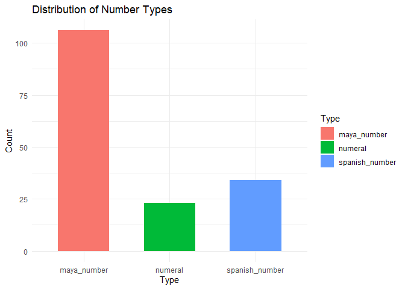
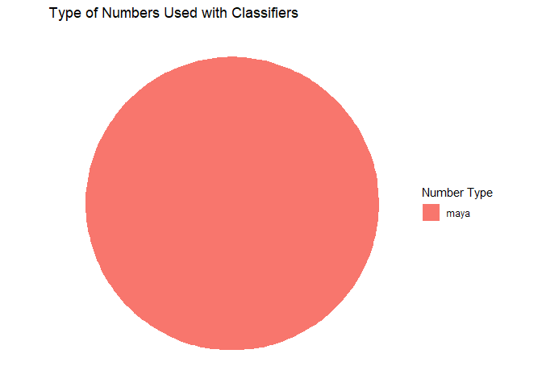
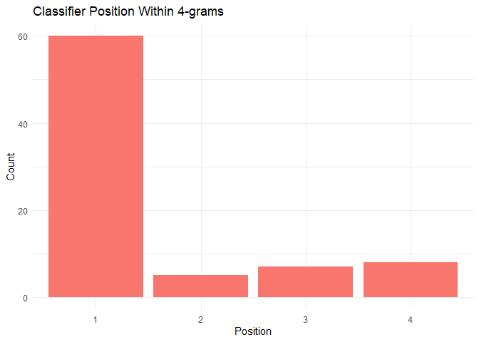
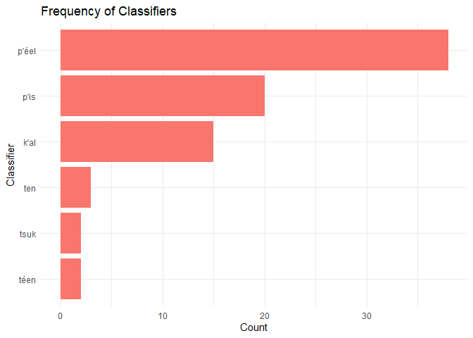

# Numbers in Colonial Maya Texts
Alex LaPrevotte
2026-04-27

## Introduction

Maya, sometimes called Yucatec Maya, is one of approximately 30 living Mayan languages, and is spoken by over 750,000 people across Mexico and Belize. It should be noted from the outset that despite recent efforts by the government of Mexico, Maya is not and never has been a standardized language, so it is common to see the same word spelled different ways, as well as variation in morphology and syntax. In Maya, numbers are generally accompanied by numeral classifiers. Numeral classifiers are words or affixes appended to numbers, which express characteristics of that number. They can describe the thing being numbered qualitatively, indicating animacy, shape, or composition, or they can describe the thing quantitatively, by size, weight, or volume. Numeral classifiers in modern Maya are often described as “obligatory” (Butler, Macri), but analysis of contemporary usage, including observations from fieldwork in Yucatán (2024, 2025), indicates that this is only the case when the number is Maya in origin. However, Maya-origin numbers are not the only thing that needs consideration; Spanish numbers are used frequently in modern Maya (Ager). In my experience with native Maya speakers, Maya numbers are used in most situations for numbers one through three, sometimes for four, rarely for five, and almost never for six and up. Spanish numbers are not always paired with classifiers and when they are, the classifier appears in a different form, though it carries the same meaning.

Maya:
>kanp'éel ja'as
>kan-p'éel ja'as
>four-CL.INAN banana
>four bananas

Spanish:
>kwaatro u p'éelel ja'as
>kwaatro u p'éel-el ja'as
>four 3s CL.INAN-NOM banana
>four bananas

## Research Questions

In this project, I will investigate the following:

* How frequently were Spanish numbers, Maya numbers, and numerals used in colonial-era Maya-language texts, and were they used interchangeably?
* Were numeral classifiers used the same way in earlier days of Maya-Spanish contact that they are now?

## Data

The data source for this project was a PDF of Dr. Julien Machault's dissertation, which included the digitization, analysis, and translation of many Maya and Spanish documents written between 1561-1869. 1522 pages of this document contain colonial-era text, of which I extracted 200 pages (pages 301-500) for analysis. The Maya-language text therein is broken into a five-line format:

* a transcription of the original colonial Maya text (in original orthography)
* a transcription of the text with modern orthography
* a morphological breakdown
* a morphological gloss
* a Spanish translation

In addition to Maya text, there are Spanish text, page numbers, document names, and footnotes. The challenge was to transform these data into a workable format and find the numbers, so I could look at how they were used and where they were paired with classifiers.

## Data Cleaning and Preparation

Data cleaning was the major hurdle of this project. PDFs are, by their nature, unfriendly to analysis, unless explicitly formatted for that purpose. The data were first [read in](Numbers-in-Colonial-Maya-Texts.md#data-read-in) and [normalized](Numbers-in-Colonial-Maya-Texts.md#fixing-split-words) by combining words and glosses broken down by morphology into single units (*e.g.* "aj- tepal" became "aj-tepal"). I converted everything into lower case. Then, I sorted through the data manually and [removed](Numbers-in-Colonial-Maya-Texts.md#row-cleaning) incomplete chunks, parts entirely in Spanish, document titles, and footers, as well as any chunks where one or more lines went onto a second row, disrupting the 5-line chunk format, which had to be preserved for my analysis. I also removed rows that only included numbers or spaces and rows that started with "doc.", "verso", or "sigue en," all of which were common in author notes. This process excised almost half of the source document, with 3,725 lines eliminated and 3970 lines retained, but most of that was blank lines, document and page numbers, Spanish text (860 lines) and authorial notation; only 64 eliminated lines were Maya textual analysis (corresponding to 10 lines of Maya text and analysis thereof).

From this point, I broke the data into 794 five-line [chunks](Numbers-in-Colonial-Maya-Texts.md#data-to-chunks), to mirror the structure of the source document. I [eliminated](Numbers-in-Colonial-Maya-Texts.md#whittling-rows) lines 1, 2, and 5 (the original text, modern orthography, and Spanish translation) of each chunk, as they were not needed for my analysis. I then [split the chunks up](Numbers-in-Colonial-Maya-Texts.md#split-by-word) by word, hypothetically giving me a one-to-one morphological breakdown of words and corresponding glosses of those words. At this point, I sought out and [removed chunks](Numbers-in-Colonial-Maya-Texts.md#NA-wrangling) containing blank fields (NAs), because if there were blank fields, that meant the breakdown and gloss for that line of text did not correspond one-to-one and would not be viable for analysis. This eliminated another 23 chunks. I [concatenated](Numbers-in-Colonial-Maya-Texts.md#chunk-concatenation) all the remaining chunks end to end, leaving me with two long rows, which I [transposed](Numbers-in-Colonial-Maya-Texts.md#transpose-data) to columns, leaving me with one word per row, the morphological breakdown in one column and the morphological gloss in the other. I performed a final sweep of [data cleaning](Numbers-in-Colonial-Maya-Texts.md#final-data-cleaning), removing all leading and trailing spaces and cells that contained only ellipses. This was the final form of my data: 3989 words, each expressed as morphological breakdown and gloss.

## Analysis

Since my analysis was focused around numbers, my first task was to [find the numbers](Numbers-in-Colonial-Maya-Texts.md#finding-numbers) in the text. The non-standardized nature of the Maya language allows a lot of room for variation. I started with creating and reading in lists of Maya and Spanish numbers with their most common spellings. The most common spellings for Spanish numbers in Maya do not necessarily correspond to the way they are spelled in Spanish (*e.g.* "quatro" is generally spelled "kwaatro" in Maya), so I included both variations and also normalized everything for accents. Then, I went through and identified all of the numbers in the gloss column; numbers were either glossed with numerals (0-9) or modern Spanish spellings. I only looked at glossed numbers that were treated as separate morphological units, those that started and ended with either word boundaries or hyphens, so as not to pick up false positives where numbers might have been part of longer, non-number glosses (such as third person, etc.). I reviewed numbers in the gloss column that did not appear to correspond to Maya numbers, Spanish numbers, or numerals in the breakdown column and found a few additional spellings, which I added into the number data sets. To be included in the analysis, a number had to be identified in both the breakdown and gloss columns. The final counts across the sample were 23 numerals, 106 Maya numbers, and 34 Spanish numbers (Fig. 1). It is noteworthy here that both Maya and Spanish numbers are over-represented, because higher numbers in both languages are often broken down into multiple words (*e.g.* "75" may correspond to "óox k’áal jo’lajun" in Maya and "setenta y cinco" in Spanish). I created [4-grams](Numbers-in-Colonial-Maya-Texts.md#4-grams), starting with each identified number, so I could see the three words that followed it.

Figure 1

I also needed to [identify the classifiers](Numbers-in-Colonial-Maya-Texts.md#finding-classifiers). I followed a similar protocol to numbers and started by reading in a list of classifiers that are relatively common in modern Maya. I did a manual review of the data for any classifiers I may have missed, and found several things in the classifier position which had not been picked up. I ultimately decided what to include based on the gloss. Some of the morphemes that seemed to function as classifiers were glossed as units of measurements, and others as "CL" (Clasificador Numeral), so I compiled a list of the three morphemes glossed as CL which were not already on the classifier list and added them. As with numbers, I only used classifiers in my analysis that were isolated in their own morpheme, to eliminate false positives where those groupings of letters were found within other words. This did eliminate some instances of possible classifiers that exhibit polysemy and can function as classifiers or as words in other contexts. For example, "k'aal," can mean "bundles" or "twenty," so "ooxk'aal" could be translated as "three bundles" (with a classifier) or "sixty" (sans classifier). I deferred to Dr. Machault's expertise as the translator in these cases and went with however he glossed it.

I then set about locating the identified classifiers within the 4-grams. I generated a count of classifiers by type of number and position. It was a surprise, if not a huge one, to find that classifiers only occurred with Maya numbers, never with Spanish numbers or numerals (Fig. 2). I visually reviewed the data to see why that may be and found that all but 3 numerals and 2 Spanish numbers were used in date expressions. In this context, it makes sense that numeral classifiers wouldn't be used, as the Maya had a totally different timekeeping system than the Spaniards, so expressing Gregorian dates in the Maya language would defy existing linguistic conventions. 

Figure 2

I also found that with Maya numbers, numeral classifiers overwhelmingly occur in the first word of the 4-grams, affixed to the number (Fig. 3). This distribution mirrors modern Maya usage, where classifiers are typically affixed directly to the numeral. Out of 80 classifiers, 60 were in the first word, 5 in the second, 7 in the third, 8 in the fourth. Now, the over-representation with Maya and Spanish numbers applies here, too. If a number is multiple words long, the numeral classifier will show up on the last word of the number, or if two numbers are just close to each other in a sentence, they may both have numeral classifiers tacked on. This is to say, some classifiers are definitely showing up in this analysis more than once and therefore being represented in multiple positions within the 4-grams.

Figure 3

The other question for me, which was not really one of my research questions but I found myself curious about, was how frequently each observed classifier was used (Fig. 4). This took a bit of finagling to get a useful result, because if I just counted the classifiers by token, I got the whole words that the classifier was usually only a part of, which led to far too many individual tokens. I instead counted them by which classifier from the list was found within each token, which gave a more useful but still imperfect token frequency; one classifier shows up twice with two separate counts, as it is spelled two different ways in the data (*téen* vs *ten*). The full list of observed classifiers and their meanings is below:

* *k'al* - this can mean "bundles" or can be the number 20
* *p'éel* - inanimate objects
* *p'is* - used in the data for various things, including amounts of time, dates, and units of distance
* *téen* - "times" (as in "this has happened four times")
* *ten* - alternate spelling of "téen"
* *tsuk* - this was only used in the data for numbers of villages and could have been specific to that purpose or more widely used for places

The most salient pattern is that *p’éel* overwhelmingly dominates classifier usage in these data, as it does in Modern Maya. Also noteworthy, three of the five (6, but two are just a spelling change) observed classifiers were the ones added from the data, and are no longer in common use in Maya. Only *p'éel* (inanimate objects) and *téen* (times) have persisted between these data samples and modern Maya.

Figure 4

## Conclusion and future research

So, let us loop back around to address the research questions. The data suggest that when the source documents were written, Maya numbers were used in Maya writing significantly more than Spanish numbers or numerals. It is impossible to know if the numerals, when spoken, would have been said in Maya or Spanish, but as they are primarily used in dates, Spanish seems likely. The modern pattern of lower numbers being expressed in Maya and higher numbers in Spanish is not visible in the data. As Maya numbers were used in a wide variety of applications and Spanish numbers and numerals were almost exclusively used for dates, their use does not appear to be interchangeable. Different numeral classifiers were in use, then, than are now, though *p'éel* was still the most common. When paired with Maya numbers, numeral classifiers generally took the same form they do now, affixed directly to the number which they modify. It also appears, based on these data, that numeral classifiers were not used with Spanish numbers at all when these documents were written.

In the future, I would like to find a way to apply this analysis to all of the Maya data in Dr. Machault's dissertation and even to other similar research--I believe he has also done analysis of the books of Chilam Balam. I also believe that this pipeline, with minor tweaking, could be used for a lot of linguistic data, as a multi-line morphological analysis is a common format.

## History and process

In this case, the data cleaning was the real problem to solve. In the early days of this code, I was working with a 14-page sample which let me muddle through a lot of the initial data cleaning without getting overwhelmed. I needed to upgrade to the 200-page sample for my analysis, though, and finding the parts which had to be manually extracted was an undertaking. In addition to identifying things that could be removed iteratively, I ended up printing all of the data out and reading through it to identify things like footnotes and whole portions in Spanish that I needed to remove. I tried various workarounds to get rid of this data in the code, but everything I tried ended up catching some of the analysis in its net, so I proceeded with manual removal. I want to acknowledge that this makes for brittle code and puts an enormous burden of work on anyone who tried to adapt it for a different sample or another purpose. I also tried to find ways to handle the over-representation of Maya and Spanish numbers, but did not find a solution that worked. I did attempt, at various points, to make portions of my code more tidyverse-friendly, but everything I tried broke something else, so I just let the tidyverse and base-R coexist where they needed to, as long as it didn't significantly impact functionality. Once I had all of the data clean and individual words correlated between the breakdown and the gloss, the analysis proceeded without significant issues.

## References

* Ager, S. (n.d.). Numbers in Yucatec Maya. Omniglot. https://omniglot.com/language/numbers/yucatecmaya.htm
* Butler, L. K. (2011). The Morphosyntax and Processing of Number Marking in Yucatec Maya (dissertation).
* Machault, J. (2025). Los títulos de ebtún: transcripción, traducción y análisis histórico [Doctoral dissertation, Universidad Nacional Autónoma de México]. Repositorio Universitario UNAM. https://hdl.handle.net/20.500.14330/TES01000869324
* Macri, M. (2000). Numeral Classifiers and Counted Nouns in the Classic Maya Inscriptions. Written Language & Literacy. 3. 13-36.